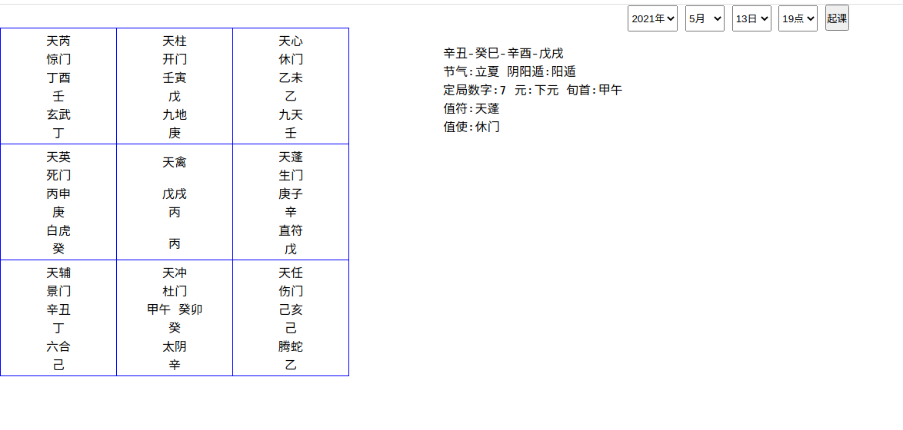

### 时家奇门

这是一个`没有传承`的奇门起局 业余爱好写写

### 安装

openSUSE Tumbleweed [下载](https://github.com/Aquarian-Age/sjqm/releases)rpm包 
```bash
sudo rpm -iv qimen-0.6.9-0.x86_64.rpm
```

### 孤虚

- 干为日　支为辰
- 孤:也名空亡,十干不到之地
- 虚:与孤相冲的地支
- 孤:空亡之辰，十干神煞不到之地。无吉无凶。
- 虚:流亡之辰，配于戊己而归中宫。

```
甲子旬中无戌亥　戌亥为孤　辰巳为虚
甲戌旬中无申酉　申酉为孤　寅卯为虚
甲申旬中无午未　午未为孤　子丑为虚
甲午旬中无辰巳　辰巳为孤　戌亥为虚
甲辰旬中无寅卯　寅卯为孤　申酉为虚
甲寅巽中无子丑　子丑为孤　午未为虚
```

- 春天宜坐东方寅卯，夏天宜坐南方巳午，秋天宜坐西方申酉，冬天宜坐北方亥子 之地而击其冲百战百胜。

- 日时论　日干支为甲子旬某一干支　时辰戌亥为孤　对冲辰巳为虚　背孤击虚

### 关于置润

```
农历是典型的阴阳历法 而且阴历不存在什么干支 只有正月 到十二月 
闰月是阴历当中有一年在两个冬至间出现没有中气的月份 这是阴历的闰月 
而奇门计算均以干支历法来的 干支历法逢12节必然会发生变化 这变化和中气 没有一点的关系 怎么就扯到一起了
所有的干支纪年都是阳历 包括北斗指向的月建  
和中气相关的只有所谓的十二宫 在国外叫十二星座 他们是随着中气的变化而变化的

闰 这个东西 是月亮绕地球过程中形成的 这是阴历 
干支和节气是地球绕太阳公转过程中形成的 这是阳历
一个是月亮绕地球公转 一个是地球绕太阳公转 两个不相干的东西扯不到一起
```

### 示例




### 感谢

[JetBrains](https://www.jetbrains.com/?from=https:/github.com/Aquarian-Age/sjqm)

